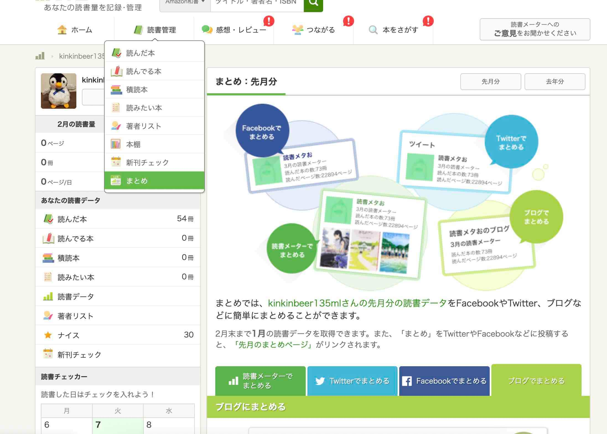

# manipulate_bookmeter_html

## Usage

### 1. Get HTML from Book-meter web site.

[Here](https://bookmeter.com/users/1313175).

### 2. Make "Before" file

Visit "読書管理>まとめ>ブログでまとめる".

1. Copy HTML on the bottom.
2. Paste into new file in this repo folder: `history_of_before`.

### 3. Generate "After" file

Execute Github Actions: `Transform HTML`.

### 4. Done.

You'll find the blog article to post in `history_of_after` folder.

## Changelog

| When | Category | What | Why | Published |
|---|---|---|---|---|
|02-07-2023|Enhancement|Adds Github Actions.|To run with the browser.|Yes|
|02-07-2023|Fixed|Rewrites Jupyter Notebook to Python file.|Code had been cluttered.|Yes|
